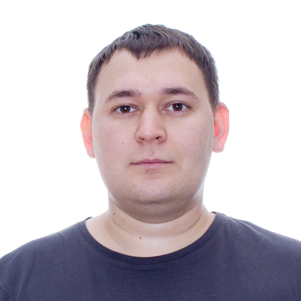

## Привет👋 Меня зовут Алексей Зайцев  

###### это я ↑
#

Мне 28 лет  
Я обучаюсь новой и интересной для себя профессии **Инженер по тестированию** в [Нетологии](https://netology.ru/).  
На данный момент полностью завершил модуль **Ручное тестирование веб-приложений**, где приобрел теоретические знания и практические навыки по следующим темам:
* Методы и виды тестирования
* Основам клиент-серверного взаимодействия
* Артефакты тестирования. Тестовая документация
* Артефакты тестирования. Дефекты
* Инструменты тестирования для работы с документацией
* Инструменты тестирования. Клиент-Сервер
* Жизненный цикл разработки ПО. Гибкие методологии разработки ПО

В скором будущем планирую освоить достаточное количество знаний и найти первую работу по новой профессии.
#

## О себе

В 2017 году я окончил [**Кубанский государственный университет**](https://www.kubsu.ru/), где мне была присвоена квалификация *горный инженер-геофизик* по специальности **технология геологической разведки**.  

С 2015 по 2017 год ежегодно принимал участие в северных морских геолого-разведочных экспедициях, где приобрел навыки **командной работы, коммуникации, физической и моральной выносливости, опыт длительного непрерывного взаимодействия с крайне ограниченным кругом коллег**.

В настоящее время работаю в *лаборатории физико-механических испытаний мерзлых грунтов испытательного центра инженерных изысканий* в должности ведущего инженера.  
